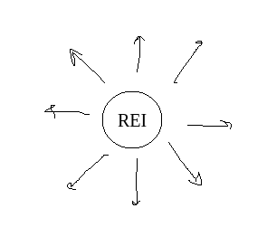
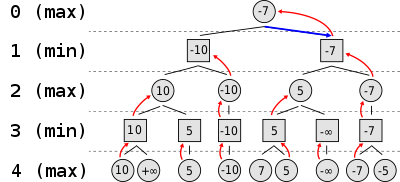

# AI

Nesta pasta encontramos os códigos referentes a inteligência artificial do projeto. Contêm os seguintes pacotes.:

## Rules

O pacote apresenta classes de criação e manipulação do tabuleiro e das peças de xadrez.

### Board

Classe que cria o tabuleiro e realiza algumas operações analogas aos métodos presentes nela.

```java
public Board();
```

- Método construtor da classe.

```java
public char[][] getBoard();
```

- Retorna o array char da posição atual

```java
public boolean isWhite(int pos_i, int pos_j);
```

- Retorna um boolean dizendo se a peça na posição _pos_i_ e _pos_j_ é branca ou não.

```java
public boolean isBlack(int pos_i, int pos_j);
```

- Retorna um boolean dizendo se a peça na posição _pos_i_ e _pos_j_ é preta ou não.

```java
public boolean isWhite(char piece);
```

- Retorna um boolean dizendo se a peça é branca ou não.

```java
public boolean isBlack(char piece);
```

- Retorna um boolean dizendo se a peça é preta ou não.

```java
public boolean hasSameColor(int me_i, int me_j, int that_piece_i, int that_piece_j);
```

- Retorna se duas peças apresentam a mesma cor.

```java
public void changePos(int begin_x, int begin_y, int final_x, int final_y);
```

- Chamada pública do método de troca.

```java
private void setChange(int begin_x, int begin_y, int final_x, int final_y);
```

- Realiza a operação de troca genérica de posição entre duas peças.

```java
public void doBlacksCastling(CastlingSide side);
```

- Método de roque para as pretas. Pede qual das duas possibilidades de roque vai ser feita.

```java
public void doWhitesCastling(CastlingSide side);
```

- Método de roque para as brancas. Pede qual das duas possibilidades de roque vai ser feita.

```java
public char getPiece(int pos_x, int pos_y);
```

- Retorna a peça presente na posição passada pelo argumento.

```java
public void printImage();
```

- Imprime uma imagem do tabuleiro no terminal.

```java
public LinkedList<Coordinate>[][] getStateBoard();
```

- Retorna o array `stateBoard[][]` do tipo `LinkedList<Coordinate>`.

```java
public boolean isBlackKingInCheck() throws Exception
```

- Verifica se o rei preto está em xeque usando o `stateBoard[][]`

```java
public boolean isWhiteKingInCheck() throws Exception
```

- Verifica se o rei branco está em xeque usando o `stateBoard[][]`

```java
public void setStateBoard(LinkedList<Coordinate> moves, int i, int j);
```

- Coloca a lista _moves_ na posição do array `stateBoard[i][j]`

```java
public boolean getHasWhiteKingMoved();
```

- Retorna se o rei branco deu o seu primeiro movimento.

```java
public boolean setHasWhiteKingMovedAsTrue();
```

- Declara que o rei branco deu o seu primeiro movimento.

```java
public boolean getHasRightWhiteRookMoved();
```

- Retorna se a torre branca da direita deu o seu primeiro movimento.

```java
public boolean getHasLeftWhiteRookMoved();
```

- Retorna se a torre branca da esquerda deu o seu primeiro movimento.

```java
public boolean setHasRightWhiteRookMovedAsTrue();
```

- Declara que a torre branca da direita deu o seu primeiro movimento.

```java
public boolean setHasLeftWhiteRookMovedAsTrue();
```

- Declara que a torre branca da esquerda deu o seu primeiro movimento.

```java
public boolean getHasBlackKingMoved();
```

- Retorna se o rei preto deu o seu primeiro movimento.

```java
public boolean setHasBlackKingMovedAsTrue();
```

- Declara que o rei preto deu o seu primeiro movimento.

```java
public boolean getHasRightBlackRookMoved();
```

- Retorna se a torre preta da direita deu o seu primeiro movimento.

```java
public boolean getHasLeftBlackRookMoved();
```

- Retorna se a torre preta da esquerda deu o seu primeiro movimento.

```java
public boolean setHasRightBlackRookMovedAsTrue();
```

- Declara que a torre preta da direita deu o seu primeiro movimento.

```java
public boolean setHasLeftBlackRookMovedAsTrue();
```

- Declara que a torre preta da esquerda deu o seu primeiro movimento.

```java
public boolean hasPawnMoved(int pos_i, int pos_j);
```

- Retorna se determinado(por suas coordenadas) peão deu o seu primeiro movimento.

```java
public ArrayList<Coordinate> indexOfPiece(char b);
```

- Retorna um _ArrayList_ das coordenadas das peças passada no argumento.

```java
public boolean isAPiece(int pos_i, int  pos_j);
```

- Retorna um _boolean_ informando se nas posições passadas no argumento, há ou não uma peça.

```java
public byte[] HowManyKindOfAttacks(ArrayList<Coordinate> movements);
```

- Retorna um array de _byte_ informando em qual jogada pode ocorrer algum tipo de ataque. É passado como argumento um _ArrayList_ de _Coordinate_ dos possíveis movimentos que uma peça pode realizar. Cada elemento do array pode apresentar os seguintes valores:

| Valor do Retorno | Significado                        |
| ---------------- | ---------------------------------- |
| 0                | Movimentação normal, troca de casa |
| 1                | Captura de uma peça                |
| 2                | Xeque                              |

```java
public boolean WillOccurCapture(ArrayList<Coordinate> movements);
```

- Retorna um _boolean_ informando se pode ocorrer uma captura de peça ou não. É passado como argumento um _ArrayList_ de _Coordinate_ dos possíveis movimentos que uma peça pode realizar.

```java
public boolean WillOccurCheck(ArrayList<Coordinate> movements);
```

- Retorna um _boolean_ informando se pode ocorrer xeque ou não. É passado como argumento um _ArrayList_ de _Coordinate_ dos possíveis movimentos que uma peça atacante pode realizar.

```java
public boolean WillOccurCheckMate(ArrayList<Coordinate> ... movements);
```

- Retorna um _boolean_ informando se pode ocorrer um xeque mate ou não. É passado como argumento um _var args_ de _ArrayList_ de _Coordinate_ dos possíveis movimentos que um conjunto de peças atacantes podem realizar.

```java
public Coordinate WherePlayToCheck(ArrayList<Coordinate> movements);
```

- Retorna um objeto _Coordinate_ da jogada do xeque.

```java
public boolean IsCheckMateInBlackKing(ArrayList<Coordinate> movements, ArrayList<Coordinate> movements1);
```

- Retorna se está se está ocorrendo um xeque-mate no Rei preto. É passado como argumento dois _ArrayList_ de _Coordinate_ das posições dos cavalos(de preferência o que está na posição de ataque), ou um valor _null_ caso não há ataque dos cavalos.

```java
public boolean IsCheckMateInWhiteKing(ArrayList<Coordinate> movements, ArrayList<Coordinate> movements1);
```

- Retorna se está se está ocorrendo um xeque-mate no Rei branco. É passado como argumento dois _ArrayList_ de _Coordinate_ das posições de dos cavalos(de preferência o que está na posição de ataque), ou um valor _null_ caso não há ataque dos cavalos.

#### Obs: Os próximos 9 métodos fazem parte da construção do algoritmo e são chamados nos métodos públicos do xeque-mate.

```java
private boolean IsCheckMate(ArrayList<Coordinate> movements, ArrayList<Coordinate> movements1, char b);
```

- Algoritmo geral para a verificação se há xeque-mate no Rei. É passado como argumento os mesmos _ArrayList_ de _Coordinate_ das posições dos cavalos, ou um valor _null_ caso não há ataque dos cavalos e um _char_ representando o rei.

#### Obs.: Os próximos 8 métodos servem para fazer a verificação das peças que estão alinhadas com o Rei. Retornam um byte informando o seguinte:

| Valor do Retorno | Significado                                            |
| ---------------- | ------------------------------------------------------ |
| 0                | Caminho livre até um dos lados das bordas do tabuleiro |
| 1                | Peça da mesma cor                                      |
| 2                | Peça adversária que está dando xeque no Rei            |



#### Figura 1: Todas as direções "_adjacantes_" ao Rei.

```java
private byte pathForwardKing(ArrayList<Coordinate> movements, ArrayList<Coordinate> movements1, char b);
```

- Verificação do caminho a frente do Rei.

```java
private byte pathBackwardKing(ArrayList<Coordinate> movements, ArrayList<Coordinate> movements1, char b);
```

- Verificação do caminho de trás do Rei.

```java
private byte pathLeftKing(ArrayList<Coordinate> movements, ArrayList<Coordinate> movements1, char b);
```

- Verificação do caminho esquerdo do Rei.

```java
private byte pathRightKing(ArrayList<Coordinate> movements, ArrayList<Coordinate> movements1, char b);
```

- Verificação do caminho direito do Rei.

```java
private byte pathTopLeftDiagonal(ArrayList<Coordinate> movements, ArrayList<Coordinate> movements1, char b);
```

- Verificação do caminho da diagonal superior esquerda do Rei.

```java
private byte pathTopRightDiagonal(ArrayList<Coordinate> movements, ArrayList<Coordinate> movements1, char b);
```

- Verificação do caminho da diagonal superior direita do Rei.

```java
    private byte pathBottomLeftDiagonal(ArrayList<Coordinate> movements, ArrayList<Coordinate> movements1, char b);
```

- Verificação do caminho da diagonal inferior esquerda do Rei.

```java
private byte pathBottomRightDiagonal(ArrayList<Coordinate> movements, ArrayList<Coordinate> movements1, char b);
```

- Verificação do caminho da diagonal inferior direita do Rei.

### Position

- Por enquanto não faz nada de mais;

### Controller

Contêm métodos que retorna um _ArrayList_ de _Coordinate_ apresentando as possiveis posições finais que cada peça pode jogar. São exemplos dessa classe os métodos:

```java
public ArrayList<Coordinate> getPawnMoves(int i, int j);
```

- Para a peça: Peão.

```java
public ArrayList<Coordinate> getRookMoves(int i, int j);
```

- Para a peça: Torre.

```java
public ArrayList<Coordinate> getKnightMoves(int i, int j);
```

- Para a peça: Cavalo.

```java
public ArrayList<Coordinate> getBishopMoves(int i, int j);
```

- Para a peça: Bispo.

```java
public ArrayList<Coordinate> getKingMoves(int i, int j);
```

- Para a peça: Rei.

```java
public ArrayList<Coordinate> getQueenMoves(int i, int j);
```

- Para a peça: Rainha.

```java
public static void uncheckedMovesBlack(Board b) throws Exception
```

- Lista todos os movimentos possíveis das pretas e salva na variável `stateBoard[][]` da `Board b`. Por enquanto não detecta cravada.

```java
public static void uncheckedMovesWhite(Board b) throws Exception
```

- Idem para as brancas.

```java
private static ArrayList<Coordinate> rookGen (int pos_i, int pos_j, Board b);
```

- Implementa o algoritmo da Torre.

```java
private static ArrayList<Coordinate> bishopGen (int pos_i, int pos_j, Board b);
```

- Implementa o algoritmo do Bispo.

#### Obs.: Os dois últimos métodos são estáticos que implementam os algoritmos para a movimentação do bispo e da torre (e consequentemente da rainha).

### Coordinate

Objeto que apresenta a posição inicial e final de determinada peça.

```java
public Coordinate(int pos_i, int pos_j);
```

- Construtor.

```java
public void printCoordinate();
```

- Imprime no terminal as coordenadas passadas no construtor.

```java
public int getPos_i();
```

- Retorna a coordenada _i_.

```java
public int getPos_j();
```

- Retorna a coordenada _j_.

### BoardOutOfBoundsException

Exceçao a ser implementada onde ArrayOutOfBounds seria lançada para Board.chessBoard.

```java
public BoardOutOfBoundsException(String message);
```

- Construtor.

### UnexpectedPieceException

Exceção a ser lançada quando os argumentos dados a um método controle se referem a uma peça diferente à esperada pelo código do método.

```java
public UnexpectedPieceException(String message);
```

- Construtor.

### IllegalCastlingException

Exceção a ser lançada quando doWhitesCastling ou doBlacksCastling são chamadas mas as condições para o roque de uma dada cor não são atendidas.

```java
public IllegalCastlingException(String message);
```

- Construtor.

## Algorithm

Neste pacote está disposto a implementação de alguns algoritmos que ajudam na construção da I.A(Inteligência Artificial).

### GraphBuilder

Esta classe cria o [Grafo](https://pt.wikipedia.org/wiki/Teoria_dos_grafos) das implementações dos algoritmos.

```java
public GraphBuilder();
```

- Método construtor da classe.

```java
public void createGraph(Coordinate c);
```

- Método sobrecarregado da construção do grafo. Recebe como argumentos um _Coordinate_ representando o primeiro nó.

```java
public void createGraph(Coordinate father, LinkedList<Coordinate> u);
```

- Método sobrecarregado da construção do grafo. Recebe como argumentos um _Coordinate_ representando o nó (pai) que gera a lista de possiveis movimentos(segundo argumento) que a peça pode jogar.

```java
public void setWeight(int u, int weight);
```

- Método que define o peso de um nó. Argumentos: nó e seu peso.

```java
public int getWeight(int u);
```

- Método que retorna o peso de um nó. Argumento: Peso.

```java
public LinkedList<Integer>[] getGraph();
```

- Método que retorna o Grafo.

```java
public int getDepth();
```

- Método que retorna a profundidade máxima do Grafo.

```java
public int getDepthFromNode(int u);
```

- Método que retorna a profundidade de um nó do Grafo. Argumento: nó.

```java
public Coordinate getCoordinate(int node);
```

- Método que retorna a coordenada de um nó. Argumento: nó.

```java
public int getNode(Coordinate c);
```

- Método que retorna o nó de determinada coordenada. Argumento : Object _Coordinate_.

```java
public void printGraph();
```

- Método que imprime a imagem do Grafo no Terminal.

```java
public void printWeightGraph();
```

- Método que imprime os pesos que são atribuídos à todos os nós.

```java
private int BrutalSearch(Coordinate c);
```

- Método que faz uma busca em O(n). Serve para a construção do Grafo. É passado como argumento um _Coordinate_.

### [Min Max](https://en.wikipedia.org/wiki/Minimax)

Aplica o algoritmo principal do jogo, atuando na tomada de decisão.

```
function minimax(node, depth, maximizingPlayer) is
    if depth = 0 or node is a terminal node then
        return the heuristic value of node
    if maximizingPlayer then
        value := −∞
        for each child of node do
            value := max(value, minimax(child, depth − 1, FALSE))
        return value
    else (* minimizing player *)
        value := +∞
        for each child of node do
            value := min(value, minimax(child, depth − 1, TRUE))
        return value

```

- Pseudo-código do algoritmo.

```
(* Initial call *)
minimax(origin, depth, TRUE)
```

- Chamada da função MinMax.

```java
public MinMax(GraphBuilder gb);
```

- Método construtor da classe. Recebe um _GraphBuilder_ para realizar as operações.

```java
public int algorithm(int node, int depth, boolean isMaximizing);
```

- Aplica o Algoritmo Min_Max, atribuindo a todos os nós os pesos. Recebe três argumentos: Nó, a profundidade e se é momento de maximização(Na primeira chamada passar este valor sendo verdadeiro).



- Imagem da aplicação do algoritmo.

```java
private void dfs(int u, int dpt, int dm);
```

- Aplica uma busca em profundidade capturando os caminhos possiveis. Recebe três argumentos: O nó, a profundidade atual e a dimensão do _LinkedList_ dos caminhos. É chamado no método _betterPath_.

```java
public LinkedList<Coordinate> betterPath();
```

- Método que retorna a lista com as melhores jogadas.

### RandomPlay

Está classe com métodos estáticos realiza um sorteio das peças e das posições para uma jogada.

```java
public static char choosePiece(int color);
```

- Retorna uma peça sorteada para ser jogada. Recebe um argumento informando a cor da peça; 0 para uma peça preta e 1 para uma peça branca.

```java
public static Coordinate chooseMovement(ArrayList<Coordinate> movements);
```

- Retorna um objeto _Coordinate_, correspondendo a coordenada da próxima jogada a ser feita. Recebe como argumento um _ArrayList_ de _Coordinate_.

## Server

Neste pacote está contido o arquivo _'Server.java'_, que faz o Server da nossa comunicação Socket com a placa que faz a ponte com o hardware. Em Server.java está disposto os seguintes métodos:

### Server

```java
public Server(int channel);
```

- Método construtor da classe. Recebe como argumento o canal da comunicação.

```java
public void setMoviment(int xo, int yo, int xf, int yf);
```

- Método que define a mensagem que deseja ser enviada. Os parâmetros são as coordenadas inicias e as finais.

```java
 public void sendMoviment();
```

- Método que envia a mensagem para o Client.

```java
public void finalizeCommunication();
```

- Finaliza a comunicação.

## Notation

Pacote de notações do Xadrez. Contém uma classe que realiza a tradução de notações.

### Translator

Realiza a tradução da notação do Xadrez para a do computador, e a recíproca é válida.

```java
public static int[] NotationChessToComputer(char pos_w, int pos_h);
```

- Realiza a tradução da notação do Xadrez para a do computador, passando dois argumentos referentes à casa e retorna um _array_ de _int_ com dois elementos correspondentes às dimensões dos elementos da matriz análoga ao tabuleiro.

```java
public static String NotationComputerToChess(int i, int j);
```

- Realiza a tradução da notação do computador para a do Xadrez, passando dois _int_ referentes às dimensões da matriz e retorna uma _String_ análoga a casa do tabuleiro.

### Annotation

Classe com métodos estáticos. Tem como objetivo anotar todas as jogadas feitas por um ou pelos dois jogadores.

```java
public static void putMovement(String movement);
```

- Anota a jogada na notação do Tabuleiro de Xadrez.

```java
public static void putMovement(int pos_i, int pos_j);
```

- Anota a jogada na notação de Matriz.

```java
public static ArrayList<String> getMovements();
```

- Retorna uma lista de todos os movimentos realizados no jogo na notação do Tabuleiro de Xadrez.

```java
public static ArrayList<Coordinate> getMovementsMatrixCoordinate();
```

- Retorna uma lista de todos os movimentos realizados no jogo na notação de Matriz.

```java
public static String getLastMovement();
```

- Retorna o último movimento realizado no jogo na notação de Matriz.

```java
public static Coordinate getLastMovementMatrixCoordinate();
```

- Retorna o último movimento movimento realizado no jogo na notação de Matriz.

## Teste

Este pacote apresenta código apenas para fins de teste.
